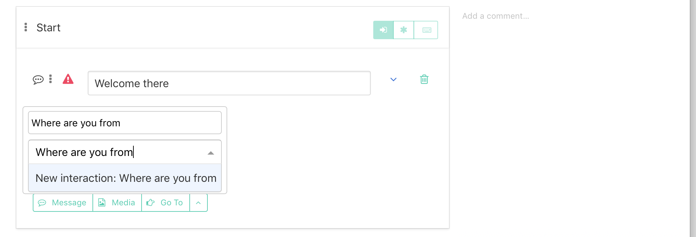
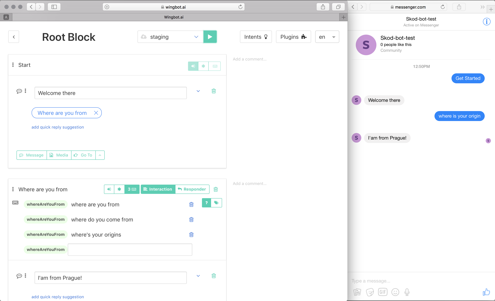

# Building a simple conversation

## Starting Interaction and fallback

  Everything starts in **Root block**.

  1. **Respond to "get started" button**

    This is one of "hard coded" interactions. Action name is generated from Interaction name - **so it's important to not change names of theese interactions**

    - create an interaction and name it "Start"
    - create a Message Response with text "Welcome there"

  2. **Response to unexpected user behavior - Fallback (*)**

    At the end of Root block, there should be an interaction with **Asterisk - ***. This will intercept all user actions, which are not matched by previous interactions.

    It's good to make few response message alternatives, which are randomly picked.

    - Create an interaction named "Fallback".
    - Enable the **Asterisk *** button beside the interaction name.
    - To make "randomized" response, add "Message" Reaction and under the drop-down arrow beside message text, press "Add random text".

  

## Be able to react to text messages

  When user writes "hello", respond with "Hi!"

  1. Create new interaction, and move it **above all Fallback (*)** interactions
  2. Name the interaction - it's good for other collaborators and for analytics
  3. Press the "keyboard button" beside the Interaction name and write down example User messages - **Intents**

    > Examples are case insensitive, no interpunction needed, only words are important. The more examples you make, the better recognition will be.

  4. Make a Message Response

  

## Lead the conversation with quick replies

  Let's make an Interaction, which explains bots origin.

  1. **Create the quick reply**

    - Find the starting interaction.
    - At the most bottom text Response click the "add quick reply suggestion" button.
    - Set the text of quick reply.
    - Write down the action name and click on "New interaction: Where are you from".

    

    - The new interaction will be created at the end of "Root Block".

  1. **Set up the newly created interaction**

    - Move it **above all Fallback (*)** interactions.
    - Make a Message Response

  2. **Make your new Interaction accessible also with text message**

    - Press the "keyboard button" beside the Interaction name and write down example User messages - **Intents**

    
